I build scalable web systems — from client-facing SaaS platforms to internal management tools. Currently working at **Skywaves IT & Network Solution**, and running my own dev studio, **VRS (Velocity Remote Studio)**, for freelance & client projects.

> Most of my work lives inside businesses that don't have an in-house dev team — hotels, POS retailers, elevator companies. I'm usually the only engineer who's ever touched their systems, so things have to be simple, reliable, and built to last without me hand-holding them.

---

### 🚀 What I work on

- **Multi-tenant SaaS platforms** — Laravel + Inertia + React, layered architecture
- **Business management systems** — hotel management (reservations, dining, QR-based guest self-service), elevator company ERP, POS systems
- **APIs & backend systems** — RESTful APIs, MySQL, scalable Laravel architecture
- Open source packages — check out [laravel-globe](https://github.com/aestheticraza/laravel-globe), a full offline geographic/localization package for Laravel (countries, states, 150k+ cities, currencies, timezones)

### 🛠️ Tech Stack

### 📊 GitHub Stats

**57** repos · **2,300+** contributions this year · Building since 2023

<!--
  Contribution snake — requires a one-time GitHub Action setup.
  Add this workflow file: .github/workflows/snake.yml
  Guide: https://github.com/Platane/snk
  Once the action runs once, this image will animate your contribution graph as a snake eating it.
  This one is safe: it's YOUR OWN GitHub Action generating a static file in YOUR repo,
  not a third-party live service — so it won't break like the typing SVG / trophy did.
-->

### 🌐 Find me elsewhere

---

📫 Open to freelance & collaboration — feel free to reach out.
